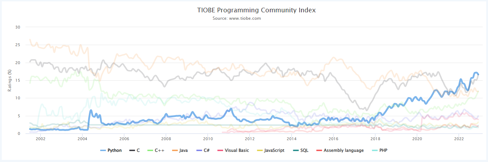
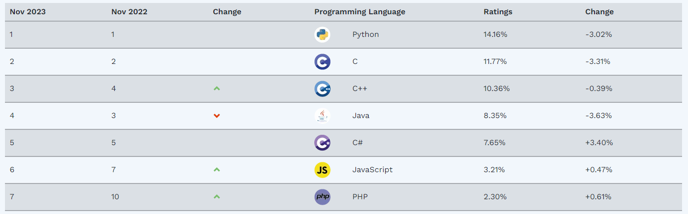
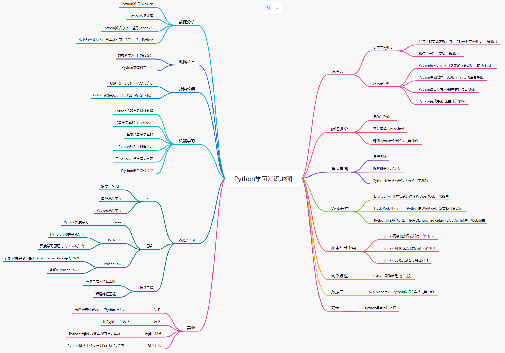

# Python

## 一、是什么？

### 简介

Python 是一种解释型、面向对象、动态数据类型的高级程序设计语言（脚本语言）。

Python 有两种运行方式：交互式和脚本式。

Python 的设计具有很强的可读性，相比其他语言经常使用英文关键字，其他语言的一些标点符号，它具有比其他语言更有特色语法结构。

- 是解释型语言： 这意味着开发过程中没有了编译这个环节。Python 解释器把源代码转换成称为字节码的中间形式，然后再把它翻译成计算机使用的机器语言并运行。
- 是交互式语言： 这意味着，您可以在一个 Python 提示符 >>> 后直接执行代码。
- 是面向对象语言: 既支持面向过程的编程也支持面向对象的编程。在“面向过程”的语言中，程序是由过程或仅仅是可重用代码的函数构建起来的。在“面向对象”的语言中，程序是由数据和功能组合而成的对象构建起来的。与其他主要的语言如 C++ 和 Java 相比，Python 以一种非常强大又简单的方式实现面向对象编程。
- 是初学者的语言：Python 对初级程序员而言，是一种伟大的语言，它支持广泛的应用程序开发，从简单的文字处理到 WWW 浏览器再到游戏。

### 发展历史

Python 由 Guido van Rossum 于 1989 年底，在荷兰国家数学和计算机科学研究所设计出来的，第一个公开发行版发行于 1991 年。Python 源代码同样遵循 GPL(GNU General Public License，GNU通用公共许可证) 协议。现在 Python 是由一个核心开发团队在维护，Guido van Rossum 仍然占据着至关重要的作用，指导其进展。

### 现行版本

#### Python 2：

1. 2000 年 10 月 16 日发布，增加了实现完整的垃圾回收，并且支持 Unicode。
2. 官方宣布，2020 年 1 月 1 日，停止 Python 2 的更新。Python 2.7 是 Python 2.x 系列的最后一个版本。

#### Python 3：

1. 即 Python 3000，或简称 Py3k。于 2008 年 12 月 3 日发布。
2. 相对于 Python 的早期版本，升级较大。为了不带入过多的累赘，Python 3.0 在设计的时候没有考虑向下兼容。

### 应用市场

TIOBE 指数：https://www.tiobe.com/tiobe-index/

## 二、能做什么？

### Python 知识地图

## 三、怎么学习？

### 参考文档

官网：https://www.python.org/

官方文档：https://docs.python.org/zh-cn/3/

Runoob：https://www.runoob.com/python3/python3-examples.html

Runoob：https://www.runoob.com/manual/pythontutorial3/docs/html/appetite.html
