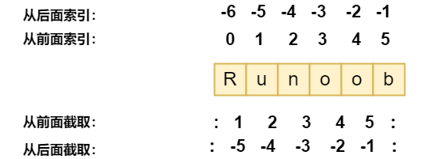

# Python3 数据类型

Python3 中有六个标准的数据类型：

- Number（数字）
- String（字符串）
- List（列表）
- Tuple（元组）
- Set（集合）
- Dictionary（字典）

Python 3 的六个标准数据类型中：

- 不可变数据（3 个）：Number（数字）、String（字符串）、Tuple（元组）。
- 可变数据（3 个）：List（列表）、Dictionary（字典）、Set（集合）。


## 1. 数字（Number）

数字有四种类型：整数（int）、布尔型（bool）、浮点数（float）和复数（复数）。

- 在 Python 中，变量不需要声明。每个变量在使用前都必须赋值，变量赋值以后该变量才会被创建。
- 在 Python 中，变量就是变量，它没有类型，我们所说的"类型"是变量所指的内存中对象的类型。可以通过赋值指向不同类型的对象。
- 在 Python 3里，只有一种整数类型 int，表示为长整型，没有 python2 中的 Long。
- 在 Python 3中，bool 是 int 的子类，True 和 False 可以和数字相加（在 Python2 中是没有布尔型的，它用数字 0 表示 False，用 1 表示 True。）
- 在混合计算时，Python 会把整型转换成为浮点数。
- 数据类型是不允许改变的，这就意味着如果改变数字数据类型的值，将重新分配内存空间。

```python
# Python允许你同时为多个变量赋值
a = b = c = 1            # 相同类型：创建一个整型对象，值为 1，从后向前赋值，三个变量被赋予相同的数值。
print(a, b, c)
"""
1 1 1
"""

a, b, c = 1, 2, "悟空"   # 不同类型：两个整型对象 1 和 2 的分配给变量 a 和 b，字符串对象 "悟空" 分配给变量 c。
print(a, b, c)
"""
1 2 悟空
"""
```

## 2. 字符串（String）

- 字符串不能改变。
- 中单引号 ' 和双引号 " 使用完全相同。
- 使用三个引号(''' 或 """)可以指定一个多行字符串。
- 字符串可以用 + 运算符连接在一起，用 * 运算符重复。
- 两种索引方式，从左往右以 0 开始，从右往左以 -1 开始。
- 没有单独的字符类型，一个字符就是长度为 1 的字符串。
- 字符串的截取的语法格式如下：变量[头下标:尾下标:步长]
- 转义符 \。
- 字符串可以用 + 运算符连接在一起，用 * 运算符重复。

### 2.1 字符串的截取

两种索引方式，从左往右以 0 开始，从右往左以 -1 开始。

```
变量[头下标:尾下标]
```



```python
a = "Hello"
b = "Python"

print("a + b 输出结果：", a + b)
print("a * 2 输出结果：", a * 2)
print("a[1] 输出结果：", a[1])
print("a[1:4] 输出结果：", a[1:4])

"""
a + b 输出结果： HelloPython
a * 2 输出结果： HelloHello
a[1] 输出结果： e
a[1:4] 输出结果： ell
"""
```

### 2.2 字符串格式化

python 字符串格式化符号：

| 符号 | 描述                                 |
| :--: | :----------------------------------- |
|  %c  | 格式化字符及其ASCII码                |
|  %s  | 格式化字符串                         |
|  %d  | 格式化整数                           |
|  %u  | 格式化无符号整型                     |
|  %o  | 格式化无符号八进制数                 |
|  %x  | 格式化无符号十六进制数               |
|  %X  | 格式化无符号十六进制数（大写）       |
|  %f  | 格式化浮点数字，可指定小数点后的精度 |
|  %e  | 用科学计数法格式化浮点数             |
|  %E  | 作用同%e，用科学计数法格式化浮点数   |
|  %g  | %f和%e的简写                         |
|  %G  | %f 和 %E 的简写                      |
|  %p  | 用十六进制数格式化变量的地址         |
