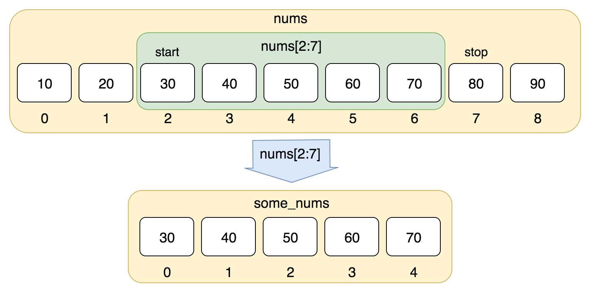
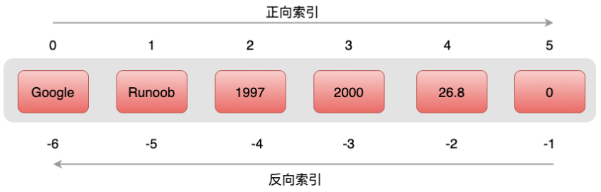
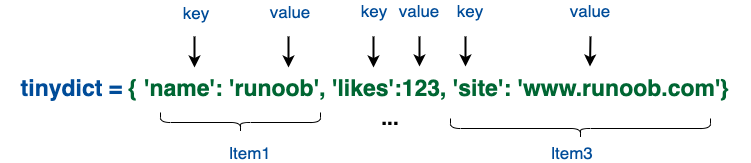

# Python3 数据结构

## 1. List（列表）

- 列表是写在方括号 [] 之间、用逗号分隔开的元素列表。[:]遵循左闭右开原则。
- 列表中元素的类型可以不相同，它支持数字，字符串甚至可以包含列表（所谓嵌套）。
- 和字符串一样，列表同样可以被索引和截取，列表被截取后返回一个包含所需元素的新列表。
- 与字符串不一样的是，列表中的元素是可以改变的。



```python
test_list = ['abc', 111, 0.12345, '列表', True]
test_sub_list = [-1, 111, 1.111, -1.111]

# 元素索引
print(test_list)                  # 输出完整列表
print(test_list[0])               # 输出列表第一个元素
print(test_list[1:3])             # 从第二个开始输出到第三个元素
print(test_list[2:])              # 输出从第三个元素开始的所有元素
print(test_list[2:-2])            # 输出从第三个元素开始至倒数第二个的所有元素
print(test_sub_list * 2)          # 输出两次列表
print(test_list + test_sub_list)  # 连接列表
print(len(test_list))             # 列表大小

'''
['abc', 111, 0.12345, '列表', True]
abc
[111, 0.12345]
[0.12345, '列表', True]
[0.12345]
[-1, 111, 1.111, -1.111, -1, 111, 1.111, -1.111]
['abc', 111, 0.12345, '列表', True, -1, 111, 1.111, -1.111]
5
'''
```

列表内置函数：

| 方法              | 描述                                                                                                                                                                                                                               |
| :---------------- | :--------------------------------------------------------------------------------------------------------------------------------------------------------------------------------------------------------------------------------- |
| list.append(x)    | 把一个元素添加到列表的结尾，相当于 a[len(a):] = [x]。                                                                                                                                                                              |
| list.extend(L)    | 通过添加指定列表的所有元素来扩充列表，相当于 a[len(a):] = L。                                                                                                                                                                      |
| list.insert(i, x) | 在指定位置插入一个元素。第一个参数是准备插入到其前面的那个元素的索引，例如 a.insert(0, x) 会插入到整个列表之前，而 a.insert(len(a), x) 相当于 a.append(x) 。                                                                       |
| list.remove(x)    | 删除列表中值为 x 的第一个元素。如果没有这样的元素，就会返回一个错误。                                                                                                                                                              |
| list.pop([i])     | 从列表的指定位置移除元素，并将其返回。如果没有指定索引，a.pop()返回最后一个元素。元素随即从列表中被移除。（方法中 i 两边的方括号表示这个参数是可选的，而不是要求你输入一对方括号，你会经常在 Python 库参考手册中遇到这样的标记。） |
| list.clear()      | 移除列表中的所有项，等于del a[:]。                                                                                                                                                                                                 |
| list.index(x)     | 返回列表中第一个值为 x 的元素的索引。如果没有匹配的元素就会返回一个错误。                                                                                                                                                          |
| list.count(x)     | 返回 x 在列表中出现的次数。                                                                                                                                                                                                        |
| list.sort()       | 对列表中的元素进行排序。                                                                                                                                                                                                           |
| list.reverse()    | 倒排列表中的元素。                                                                                                                                                                                                                 |
| list.copy()       | 返回列表的浅复制，等于a[:]。                                                                                                                                                                                                       |

列表内置函数使用实例：

```python
test_list = [1, 111, 2.2, 3, 4]
test_sub_list = [-1, 111, 1.111, -1.111]

# 内置函数
test_list.append(1)
print(test_list)                  # 把一个元素添加到列表的结尾。
test_list.insert(0, 1.1)          # 在指定位置插入一个元素。
test_list.extend(test_sub_list)   # 通过添加指定列表的所有元素来扩充列表。
print(test_list)                  # 在指定位置插入一个元素。
print(test_list.pop(1))           # 从列表的指定位置移除元素，并将其返回。如果没有指定索引，a.pop()返回最后一个元素。元素随即从列表中被移除。
print(test_list.index(111))       # 返回列表中第一个值为 x 的元素的索引。如果没有匹配的元素就会返回一个错误。
print(test_list.count(111))       # 返回 x 在列表中出现的次数。
test_list.remove(True)            # 删除列表中值为 x 的第一个元素。如果没有这样的元素，就会返回一个错误。
print(test_list)
test_list.reverse()               # 倒排列表中的元素。
print(test_list)
```

### 1.1 将列表当做堆栈使用

列表方法使得列表可以很方便的作为一个堆栈来使用，堆栈作为特定的数据结构，最先进入的元素最后一个被释放（后进先出）。用 append() 方法可以把一个元素添加到堆栈顶。用不指定索引的 pop() 方法可以把一个元素从堆栈顶释放出来。

```python
# 将列表当做堆栈使用
stack = [1, 2, 3, 4, 5]
stack.append(6)
print(stack)
print(stack.pop())
print(stack)
print(stack.pop())
print(stack.pop())
print(stack)
```

### 1.2 将列表当作队列使用

也可以把列表当做队列用，只是在队列里第一加入的元素，第一个取出来；但是拿列表用作这样的目的效率不高。在列表的最后添加或者弹出元素速度快，然而在列表里插入或者从头部弹出速度却不快（因为所有其他的元素都得一个一个地移动）。

## 2. 元组（tuple）

与列表类似，不同之处在于元组的元素不能修改。元组使用小括号 ( )，列表使用方括号 [ ]。元素之间都用逗号隔开。

与字符串一样，元组的元素不能修改。



```python
tupleTest = ()     # 空元组
print(tupleTest)
tupleTest = (20,)  # 一个元素，需要在元素后添加逗号
print(tupleTest)

tupleTest = ('abc', 111, 0.12345, '列表', True)
tinyTuple = (123, 'TEST')

print(tupleTest)              # 输出完整元组
print(tupleTest[0])           # 输出元组的第一个元素
print(tupleTest[1:3])         # 输出从第二个元素开始到第三个元素
print(tupleTest[2:])          # 输出从第三个元素开始的所有元素
print(tinyTuple * 2)          # 输出两次元组
print(tupleTest + tinyTuple)  # 连接元组
tupleList = (tupleTest, tinyTuple)
print(tupleList)
# tupleTest[0] = 11             # 修改元组元素的操作是非法的：TypeError: 'tupleTest' object does not support item assignment

'''
()
(20,)
('abc', 111, 0.12345, '列表', True)
abc
(111, 0.12345)
(0.12345, '列表', True)
(123, 'TEST', 123, 'TEST')
('abc', 111, 0.12345, '列表', True, 123, 'TEST')
(('abc', 111, 0.12345, '列表', True), (123, 'TEST'))
'''
```

## 3. 集合（set）

由一个或数个形态各异的大小整体组成的，构成集合的事物或对象称作元素或是成员。

- 基本功能是进行成员关系测试和删除重复元素。
- 可以使用大括号 { } 或者 set() 函数创建集合，注意：创建一个空集合必须用 set() 而不是 { }，因为 { } 是用来创建一个空字典。
- 重复的元素在取值时会被自动去掉。

```python
sites = {'Google', 'Taobao', 'WeiXin', 'Facebook', 'Zhihu', 'Baidu', 'WeiXin'}

print(sites)   # 输出集合，重复的元素被自动去掉
"""
{'Zhihu', 'Taobao', 'Google', 'WeiXin', 'Facebook', 'Baidu'}
"""
```

集合运算：

```python
# set可以进行集合运算
a = set('Gooooooooooooogllleee')
b = set('Taobao Gou')

print(a)
print(a - b)     # a 和 b 的差集
print(a | b)     # a 和 b 的并集
print(a & b)     # a 和 b 的交集
print(a ^ b)     # a 和 b 中不同时存在的元素
"""
{'e', 'l', 'g', 'G', 'o'}
{'e', 'l', 'g'}
{'e', 'a', 'u', 'l', 'g', 'G', 'b', 'T', ' ', 'o'}
{'G', 'o'}
{'e', 'l', 'g', 'a', 'u', 'b', 'T', ' '}
"""
```

## 4. 字典（dictionary）

列表是有序的对象集合，字典是无序的对象集合。两者之间的区别在于：字典当中的元素是通过键来存取的，而不是通过偏移存取。

- 字典是一种映射类型，字典用 { } 标识，它是一个无序的 键(key) : 值(value) 的集合。
- 键(key)必须使用不可变类型。
- 在同一个字典中，键(key)必须是唯一的。



```python
dict = {}  # 空字典
dict['one'] = "1 - Python学习"
dict[2] = "2 - Python编程"
tinyDict = {'name': 'Python', 'code': 1, 'site': 'www.baidu.com'}

print(dict['one'])        # 输出键为 'one' 的值
print(dict[2])            # 输出键为 2 的值
print(tinyDict)           # 输出完整的字典
print(tinyDict.keys())    # 输出所有键
print(tinyDict.values())  # 输出所有值

'''
1 - Python学习
2 - Python编程
{'name': 'Python', 'code': 1, 'site': 'www.baidu.com'}
dict_keys(['name', 'code', 'site'])
dict_values(['Python', 1, 'www.baidu.com'])
'''

```
