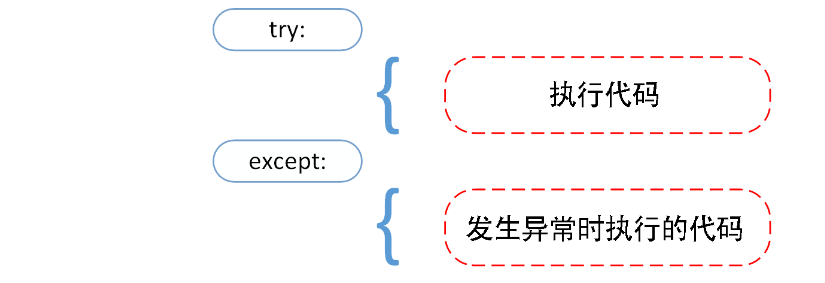
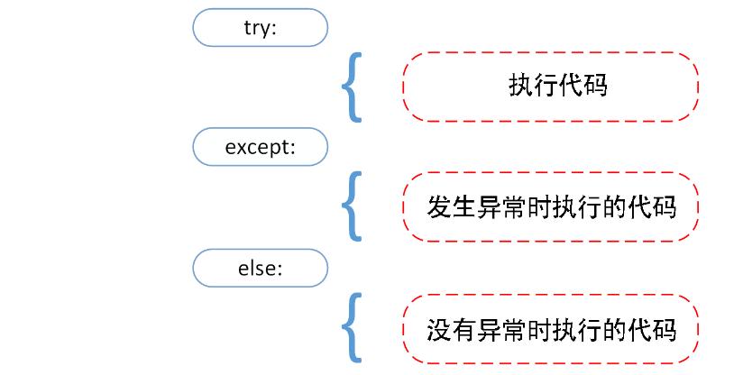
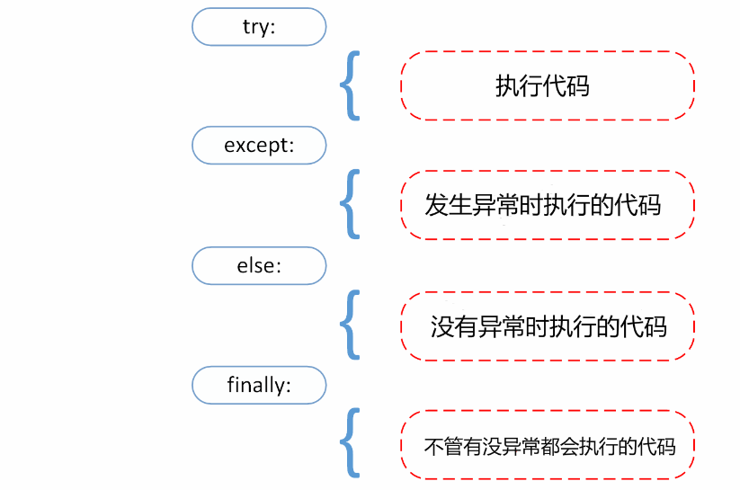

# Python3 错误和异常

Python 有两种错误很容易辨认：语法错误和异常。

Python assert（断言）用于判断一个表达式，在表达式条件为 false 的时候触发异常。


## 1. 语法错误

即解析错误。

交互式解释器没有显示提示；一般 Python 集成开发环境有肉眼可见错误提示。

```
>>> while True print('Hello world')
  File "<stdin>", line 1
    while True print('Hello world')
               ^
SyntaxError: invalid syntax
```

这个例子中，函数 print() 被检查到有错误，是它前面缺少了一个冒号 : 。

语法分析器指出了出错的一行，并且在最先找到的错误的位置标记了一个小小的箭头。

## 2. 异常

运行期检测到的错误被称为异常。

大多数的异常都不会被程序处理，都以错误信息的形式展现在这里:
异常1：

```python
print(1 / 0)    # 0 不能作为除数，触发异常
'''
  File "...\F20_Start\错误和异常.py", line 3, in <module>
    print(1 / 0)    # 0 不能作为除数，触发异常
ZeroDivisionError: division by zero
'''
```

异常2：

```python
print(1 + '1')  # int 不能与 str 相加，触发异常
'''
  File "...\F20_Start\错误和异常.py", line 10, in <module>
    print(1 + '1')  # int 不能与 str 相加，触发异常
TypeError: unsupported operand type(s) for +: 'int' and 'str'
'''
```

异常3：

```
>>> print(1 + a)
Traceback (most recent call last):
  File "<stdin>", line 1, in <module>
NameError: name 'a' is not defined
>>> print(1 /)
  File "<stdin>", line 1
    print(1 /)
             ^
SyntaxError: invalid syntax
```

异常以不同的类型出现，这些类型都作为信息的一部分打印出来: 例子中的类型有 ZeroDivisionError，NameError 和 TypeError 等。

错误信息的前面部分显示了异常发生的上下文，并以调用栈的形式显示具体信息。

## 3. 异常处理

### 3.1 try/except

异常捕捉可以使用 `try/except` 语句。类似 Java 的 try/catch。




### 3.2 try/except ... else




### 3.3 try-finally




## 4. 抛出异常

Python 使用 raise 语句抛出一个指定的异常。

## 5. 自定义异常

创建一个新的异常类来拥有自己的异常。异常类继承自 Exception 类，可以直接继承，或者间接继承。

```python
# 用户自定义异常
class MyError(Exception):
    def __init__(self, value):
        self.value = value

    def __str__(self):
        return repr(self.value)


try:
    raise MyError()
except MyError as e:
    print('My exception occurred, value:', e.value)
```

运行结果：

```
  File "...\240.错误和异常.py", line 31, in <module>
    raise MyError()
TypeError: __init__() missing 1 required positional argument: 'value'
```
