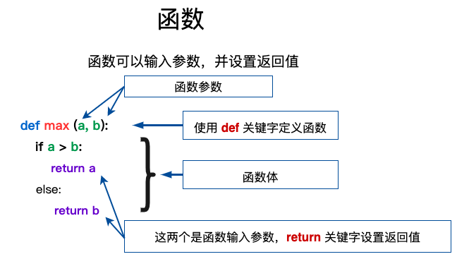

# Python3 函数

函数是组织好的，可重复使用的，用来实现单一，或相关联功能的代码段。
函数能提高应用的模块性，和代码的重复利用率。你已经知道Python提供了许多内建函数，比如print()。但你也可以自己创建函数，这被叫做用户自定义函数。



## 1. 定义函数

你可以定义一个由自己想要功能的函数，以下是简单的规则：

- 函数代码块以 def 关键词开头，后接函数标识符名称和圆括号 ()。
- 任何传入参数和自变量必须放在圆括号中间，圆括号之间可以用于定义参数。
- 函数的第一行语句可以选择性地使用文档字符串，用于存放函数说明。
- 函数内容以冒号 : 起始，并且缩进。
- return [表达式] 结束函数，选择性地返回一个值给调用方，不带表达式的 return 相当于返回 None。

## 2. 函数参数

### 2.1 参数类型

以下是调用函数时可使用的参数类型：

- `必需参数`：即调用另一个有参数定义的函数时，必须传参给该函数。调用时的数量必须和声明时的一样。
- `关键字参数`：使用关键字参数允许函数调用时参数的顺序与声明时不一致，因为 Python 解释器能够用参数名匹配参数值。
- `默认参数`：如果一个函数入参有设置默认值，但在调用该函数时，如果没有传递参数，则会使用预先设置的默认值。
- `强制位置参数`：Python3.8 新增了一个函数形参语法 / 用来指明函数形参必须使用指定位置参数，不能使用关键字参数的形式。
- `不定长参数`：即可变参数。一个函数能处理比当初声明时更多的参数。这些参数叫做不定长参数，和上述 2 种参数不同，声明时不会命名。
  - 语法【def functionname([formal_args,] *var_args_tuple ):】，加了星号 * 的参数会以元组(tuple)的形式导入，存放所有未命名的变量参数。我们也可以不向函数传递未命名的变量。如果在函数调用时没有指定参数，它就是一个空元组。
  - 语法【def functionname([formal_args,] **var_args_dict ):】，加了两个星号 ** 的参数会以字典的形式导入。

```python
# 默认参数
def print_info(name, age=66):        # 调用函数时，如果age没有传递参数，则会使用默认参数
    print("名字: %s，年龄: %s" % (name, age))
    return
print_info(age=50, name="Python")    # 使用关键字参数允许函数调用时参数的顺序与声明时不一致，因为 Python 解释器能够用参数名匹配参数值。
print_info(name="Python")            # 调用函数时，如果没有传递参数，则会使用默认参数。以下实例中如果没有传入 age 参数，则使用默认值。

# 不定长参数（**：字典形式）
def print_info_dict(name, age=66, **vardict):
    print("名字: %s，年龄: %s" % (name, age))
    print("不定长参数: ", vardict)
    return
print_info_dict(age=77, name="Python", id=111, sex='男')

# 不定长参数（*：元组形式）
def print_info_tuple(userid, *vartuple):
    print("输出: ", userid)
    print("不定长参数: ", vartuple)
print_info_tuple(1, 2, 3)
```

### 2.2 参数传递

1）`传不可变对象`：类似 C++ 的值传递，如整数、字符串、元组。如 fun(a)，传递的只是 a 的值，没有影响 a 对象本身。如果在 fun(a) 内部修改 a 的值，则是新生成一个 a 的对象。

```python
# 不可变对象实例
def change(a):
    print("2.1.函数内取值: %s，内存地址：%s" % (a, id(a)))   # 指向的是同一个对象
    a = 111
    print("2.2.函数内取值: %s，内存地址：%s" % (a, id(a)))   # 一个新对象
    return a
a = 1
print("1.1.函数外取值: %s，内存地址：%s" % (a, id(a)))
change(a)
print("1.2.函数外取值: %s，内存地址：%s" % (a, id(a)))
a = change(a)
print("1.3.函数外取值: %s，内存地址：%s" % (a, id(a)))
```

输出：

```
1.1.函数外取值: 1，内存地址：16674944
2.1.函数内取值: 1，内存地址：16674944
2.2.函数内取值: 111，内存地址：16676704
1.2.函数外取值: 1，内存地址：16674944
2.1.函数内取值: 1，内存地址：16674944
2.2.函数内取值: 111，内存地址：16676704
1.3.函数外取值: 111，内存地址：16676704
```

2）`传可变对象`：类似 C++ 的引用传递，如 列表，字典。如 fun(la)，则是将 la 真正的传过去，修改后 fun 外部的 la 也会受影响。

```python
def chang_list(test_list):
    test_list.append([1, 2, 3, 4])           # 修改传入的列表
    print("函数内取值: %s，内存地址：%s" % (test_list, id(test_list)))
    return
# 调用 changList 函数
test_list = [10, 20, 30]
chang_list(test_list)
print("函数外取值: %s，内存地址：%s" % (test_list, id(test_list)))
```

输出：

```
函数内取值: [10, 20, 30, [1, 2, 3, 4]]，内存地址：42082280
函数外取值: [10, 20, 30, [1, 2, 3, 4]]，内存地址：42082280
```

## 3. 匿名函数

所谓匿名，意即不再使用 def 语句这样标准的形式定义一个函数。Python 使用 `lambda` 来创建匿名函数。

- lambda 只是一个表达式，函数体比 def 简单很多。
- lambda 的主体是一个表达式，而不是一个代码块。仅仅能在 lambda 表达式中封装有限的逻辑进去。
- lambda 函数拥有自己的命名空间，且不能访问自己参数列表之外或全局命名空间里的参数。
- 虽然 lambda 函数看起来只能写一行，却不等同于 C 或 C++ 的内联函数，后者的目的是调用小函数时不占用栈内存从而增加运行效率。

```python
# lambda 匿名函数
sum = lambda arg1, arg2: arg1 + arg2

# 调用sum函数
print("相加后的值为 : ", sum(1, 2))
print("相加后的值为 : ", sum(11, 22))
```
